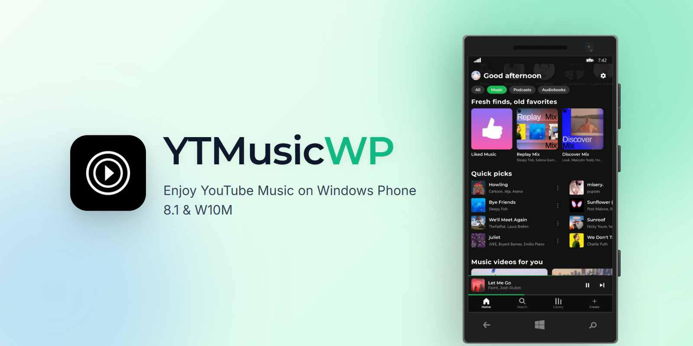
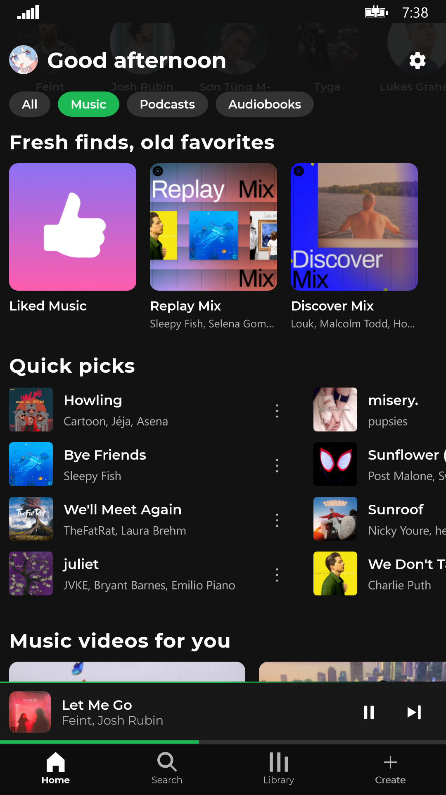
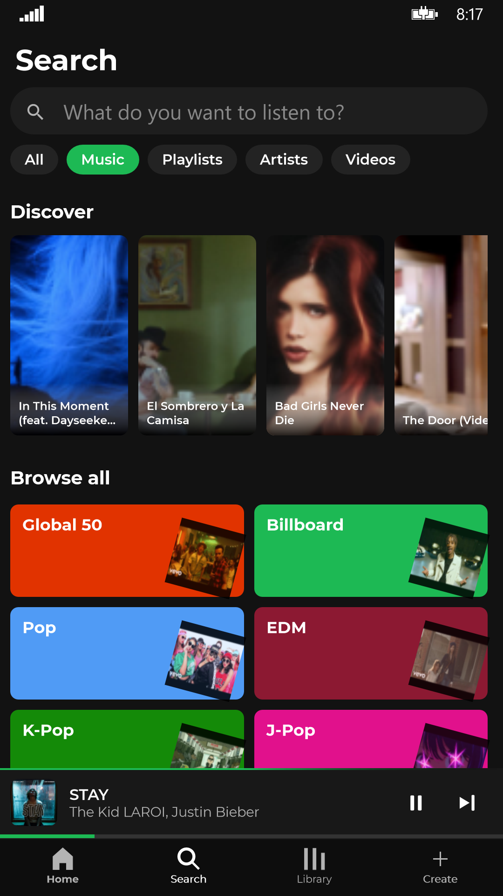
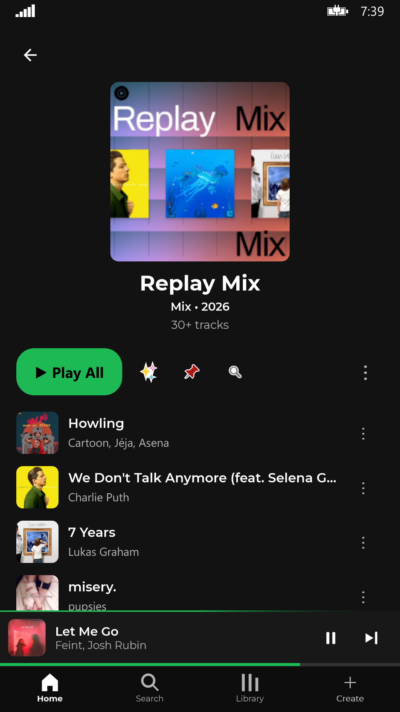
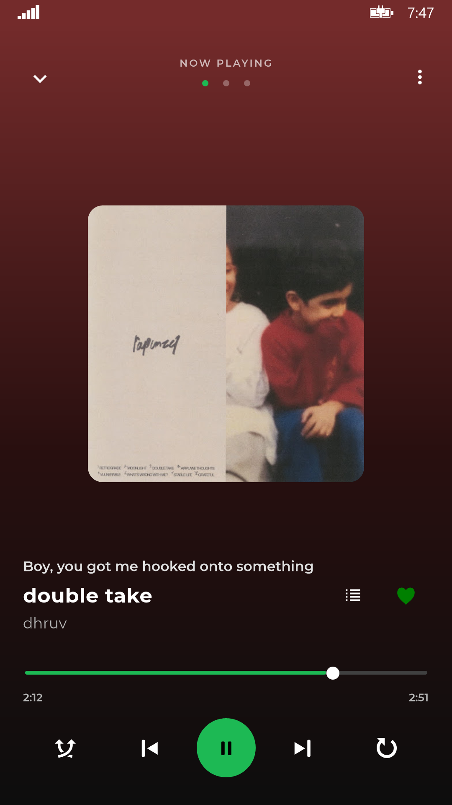
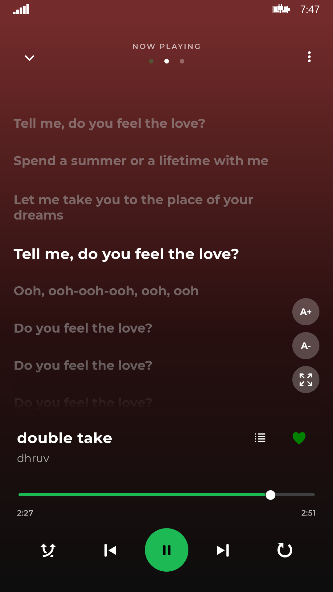
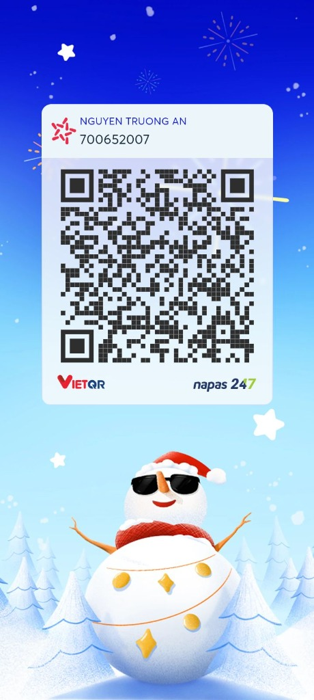

<div align="center"> 
  
  <h1>YTMusicWP</h1>  
  A modern, lightning-fast native YouTube Music client crafted for Windows Phone 8.1 and Windows 10 Mobile.<br>
  Breathe new life into legacy Lumia devices with direct stream playback, synced lyrics, and iconic Live Tiles.
  <br>
  <br>
  <a href="https://github.com/Yasukoisreal/YTMusicWP/releases"></a>
  <a href="https://github.com/Yasukoisreal/YTMusicWP"></a>
  <a href="https://github.com/Yasukoisreal/YTMusicWP"></a>
  <a href="https://github.com/Yasukoisreal/YTMusicWP/releases"></a> 
  <a href="https://github.com/Yasukoisreal/YTMusicWP/releases"></a>
  <br> 
  <h4>Download</h4>  
  <a href="https://store.live.net.co/app/447"></a> 
  <br>
  <a href="https://github.com/Yasukoisreal/YTMusicWP/releases"></a> 
</div>  

> YTMusicWP brings the full YouTube Music experience back to your legacy Windows devices!

## Features ✨️    
- Play music from YouTube Music for free, without ads and in the background
- High-quality streaming directly from YouTube without delays
- Control your music using volume buttons, from the lock screen, or with your headset
- Smooth crossfade transitions between songs (1s – 10s)
- Smart Queue with shuffle, repeat, and automatic infinite song recommendations
- Real-time synchronized scrolling lyrics with adjustable text size and colors
- Huge lyrics database to automatically find the best lyrics for your songs
- Iconic Metro Live Tiles (Now Playing Flip Tile, People Hub Style Mosaic)
- Pin your favorite artists, albums, or playlists directly to your Start Screen
- Easy and secure login by simply scanning a QR Code with your phone
- Full library sync including Liked Music, custom YouTube playlists, and subscribed artists
- Offline support: Download songs directly to your phone to enjoy music without internet
- Manage local downloads, create custom local playlists, and track playback history
- Shorts Music Discovery: Vertical swipe feed for trending music snippets
- Highly optimized to run perfectly without crashing, even on older phones with just 512MB RAM like the Nokia Lumia 520

## Screenshots    
<p align="center">          
            
            
            
   
</p> 
<p align="center">          
            
            
            
   
</p> 

## Supported Devices

- **512MB Low-End:** Lumia 520, 525, 530, 535, 620, 625, 630, 635 (✅ Ultra-Smooth)
- **1GB+ Mid-Range & Flagships:** Lumia 720, 730/735, 820, 830, 920, 925, 930, 1020, 1520, Icon (✅ Flawless Experience)
- **Windows 10 Mobile:** Lumia 550, 640/640 XL, 650, 950/950 XL, HP Elite x3, Alcatel Idol 4S (✅ Fully Compatible)

## Data    
- This app safely connects directly to YouTube Music to get your songs and playlists using hidden APIs without needing a web browser.
- Login is handled securely using Google's official device login method (`google.com/device`). We never see or store your password.
- Thanks to [SimpMusic](https://github.com/maxrave-dev/SimpMusic) and [Metrolist](https://github.com/metrolistgroup/metrolist). These repos are my inspiration to upgrade UI and add more features to this app.
- My app is using [SponsorBlock](https://sponsor.ajay.app/) to skip sponsor in YouTube videos.
- Main lyrics data from YouTube subtitles and [Lyrics API](https://lyrics-api.boidu.dev).
- Alternative lyrics data from [LRCLIB](https://lrclib.net/).
 
## Privacy    
YTMusicWP is a completely free, open-source application. We do not include any third-party trackers, analytics, or hidden data collection. Your data stays on your device. The app communicates directly and only with YouTube's servers to fetch your music, playlists, and provide playback. No middleman servers are used to stream your music.

## Installation Guide

### Method 1: Live Store (Recommended)
The easiest way to install and update YTMusicWP is directly from the Live Store. Click the download button at the top of this page to get it.

### Method 2: Manual Sideloading
**Windows Phone 8.1:**
1. Download the latest `.appx` and `.cer` files from [Releases](https://github.com/Yasukoisreal/YTMusicWP/releases).
2. Install the `.cer` certificate on your Lumia device first (open via email or file manager).
3. Install the `.appx` app file using **Windows Phone Application Deployment (WPAD)**, **WPV Xap Deployer**, or **Windows Phone Power Tools**.

**Windows 10 Mobile:**
1. Navigate to **Settings** > **Update & Security** > **For developers** and enable **Developer mode**.
2. Download the `.appx` package to your phone, open the file in **File Explorer** and tap **Install**.

## FAQ    
#### 1. Why does the app sometimes fail to play a song?    
Because the app connects directly to YouTube Music, changes made by YouTube can sometimes break the music streaming. We actively release small updates (hotfixes) to fix the app whenever YouTube changes their systems.

#### 2. Does this work on 512MB RAM Windows Phones?    
Yes! YTMusicWP has been carefully built for older Lumia devices. The app uses very little memory, ensuring it won't crash even on devices like the Nokia Lumia 520.

## Changelog

### v2.1.3.1 BETA (Latest)
- 🛠️ **Hotfix:** Fixed an issue where the "Liked Songs" playlist would not sync or was missing information (titles, covers).
- 🛠️ **Hotfix:** Fixed an issue where the app would crash when loading the Library tab.

### v2.1.3 BETA
- 🛠️ **Hotfix:** Restored music playback after YouTube server changes caused songs to load indefinitely.

### v2.1.2 BETA
- 🛠️ **Hotfix:** Fixed a critical bug causing "No stream available" errors.

### v2.1.1 BETA
- 🛠️ **Hotfix:** Fixed a bug in the Library tab that caused the app to crash on older phones (like Lumia 520).

### v2.1 BETA
- 🔐 **QR Code Login:** Added QR Code to make the login process more convenient.
- 🖼️ **Live Tiles:** Added Live Tile support for the Start Screen.
- ⚡ **Performance:** Bug fixes and memory optimizations.

## Contributing

Contributions, bug reports, and pull requests are warmly welcome!
1. Found a bug? Open an [Issue](https://github.com/Yasukoisreal/YTMusicWP/issues).
2. Want to add a feature? Fork the repository and submit a PR.

**AI Policy:** AI-*assisted* work is welcome; AI-*driven* work is not. Unattended agent submissions (PRs fired by coding agents) are closed automatically. A human must review every line of code submitted. See [CONTRIBUTING.md](CONTRIBUTING.md) for full details.

### Building from Source
- Windows 8.1 / 10 / 11
- Visual Studio 2015 (with Windows Phone 8.1 SDK installed)
- MSBuild v14.0

```powershell
git clone https://github.com/Yasukoisreal/YTMusicWP.git
cd YTMusicWP
.\nuget.exe restore YTMusicWP.sln
& "C:\Program Files (x86)\MSBuild\14.0\Bin\MSBuild.exe" YTMusicWP.sln /p:Configuration=Release /p:Platform=ARM
```

## Legal Disclaimer & Terms of Use

### 1. Free & Non-Commercial
YTMusicWP is a completely free, open-source project created purely for educational purposes and personal use. We do not sell this application, nor do we make any money from it. There are no advertisements or premium features.

### 2. A Custom Client
YTMusicWP acts strictly as a specialized, third-party client. It simply reads the publicly available data from YouTube Music and displays it in a beautiful interface made for Windows Phone.

### 3. Support Content Creators
We deeply respect the hard work of artists, musicians, and content creators. We strongly encourage all users to subscribe to [YouTube Premium](https://www.youtube.com/premium) to financially support the creators you listen to.

### 4. No Hosting of Copyrighted Material
We do not host, upload, distribute, or store any audio, video, or copyrighted media files on our own servers. All content accessed through this application is stored entirely on Google's and YouTube's servers.


## Support & Donations 
If you enjoy using YTMusicWP and want to support the development, consider buying me a coffee! Your support helps keep this project alive for the Windows Phone & Lumia community.

**Buy Me A Coffee**
- **Link:** [buymeacoffee.com/yasukoisreal](https://buymeacoffee.com/yasukoisreal)

**International (PayPal)**
- **PayPal.me:** [paypal.me/yasukoisreal](https://paypal.me/yasukoisreal)

**Vietnam (MB Bank)**
- **Account Number:** `700652007`
- **Account Name:** NGUYEN TRUONG AN



## License
This project is licensed under the [MIT License](LICENSE).

<div align="center">
  Crafted with ❤️ for the Windows Phone & Lumia community by <strong>Yasuko (An)</strong>.
</div>
