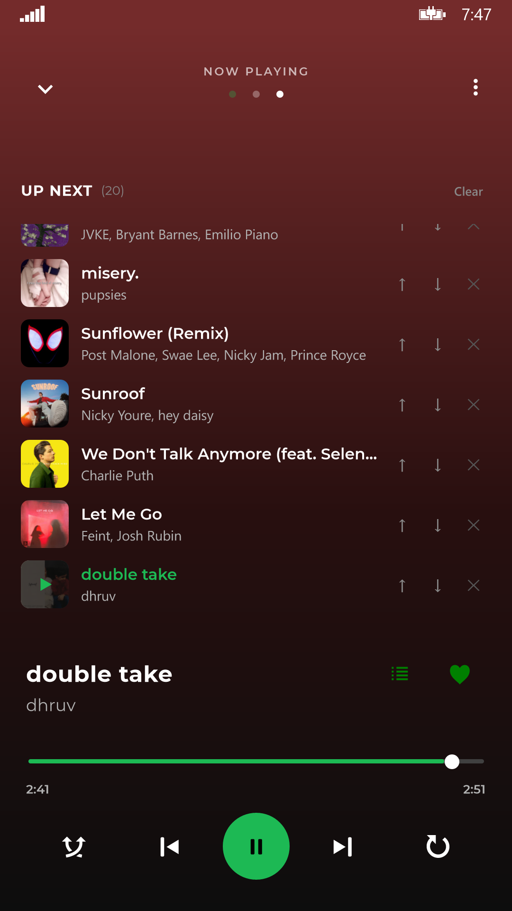
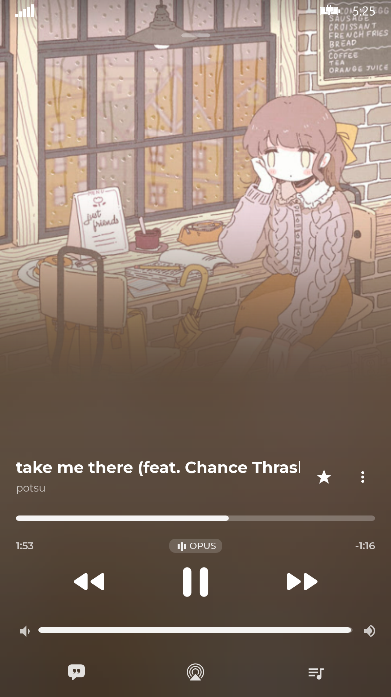
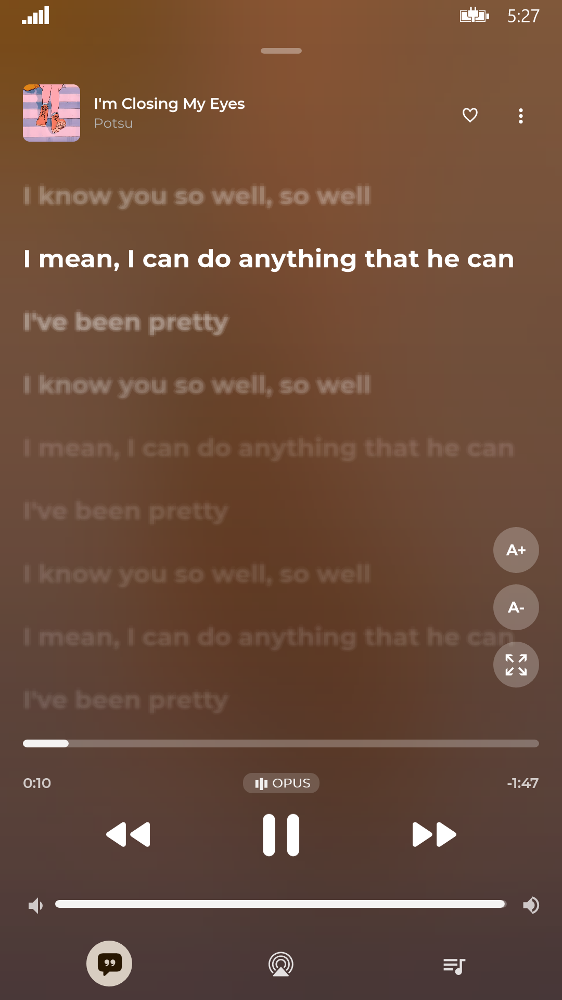
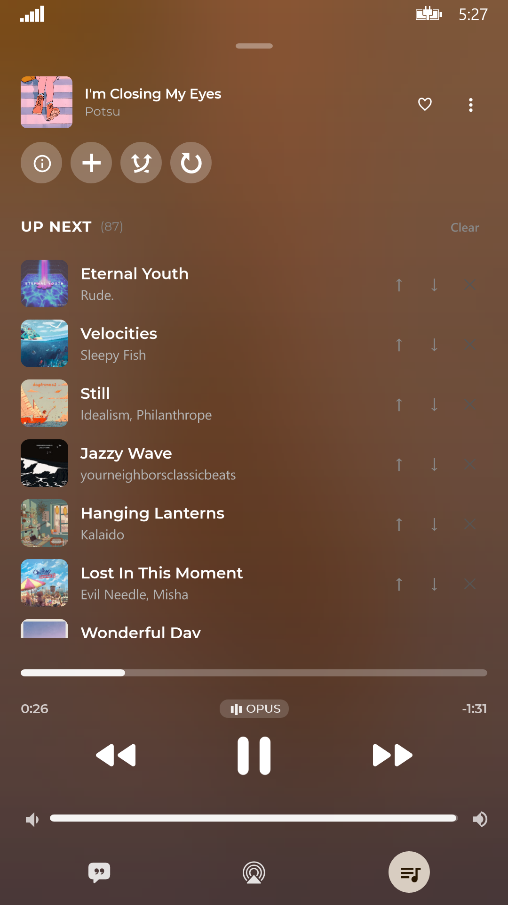

<div align="center"> 
  
  <h1>YTMusicWP</h1>  
  A modern, lightning-fast native YouTube Music client crafted for Windows Phone 8.1 and Windows 10 Mobile.<br>
  Breathe new life into legacy Lumia devices with direct stream playback, synced lyrics, and iconic Live Tiles.
  <br>
  <br>
  <a href="https://github.com/Yasukoisreal/YTMusicWP/releases"></a>
  <a href="https://github.com/Yasukoisreal/YTMusicWP"></a>
  <a href="https://github.com/Yasukoisreal/YTMusicWP"></a>
  <a href="https://github.com/Yasukoisreal/YTMusicWP/releases"></a> 
  <a href="https://github.com/Yasukoisreal/YTMusicWP/releases"></a>
  <br> 
  <h4>Download</h4>  
  <a href="https://store.live.net.co/app/447"></a> 
  <br>
  <a href="https://github.com/Yasukoisreal/YTMusicWP/releases"></a> 
</div>  

> YTMusicWP brings the full YouTube Music experience back to your legacy Windows devices!

## Features ✨️    
- Play music from YouTube Music for free, without ads and in the background
- High-quality streaming directly from YouTube with multi-client fallback engine
- Zero-gap continuous YouTube Live audio streaming with low-latency rolling buffer and live telemetry
- Listen Together: Real-time room music synchronization (compatible with Metrolist and SimpMusic) with live queue, synchronized playback, and guest seek
- Customizable Now Playing Experience: Switch between classic Spotify dark aesthetic and modern Apple Music style with hardware-accelerated blurred backdrop (Lumia Imaging SDK 2.0), edge-to-edge transparent UI, and spring elasticity animations
- Control your music using volume buttons, from the lock screen, or with your headset
- Smart Queue with shuffle, repeat, and automatic infinite song radio recommendations
- Real-time synchronized scrolling lyrics with Apple Music defocus blur effect, distance falloff, adjustable text size, and multi-source fallback (YouTube, LRCLIB, TTML)
- Mini Lyric on Now Playing with smooth fade and infinite marquee animation
- SponsorBlock integration: Automatically skip sponsor segments, intros, music video interludes, and outros
- Dynamic Home Tab: Live YouTube carousels (Quick Picks, Moods & Genres, 16:9 videos) with smooth incremental loading and native pull-to-refresh
- Rich YouTube Music search query suggestions, entity suggestions, and tilted Moods & Genres exploration cards
- Multi-Method Google Login: Easy QR Code device scan or direct Cookie-based authentication (SAPISIDHASH)
- Redesigned SimpMusic Library: 4 quick-access tiles, dynamic YouTube filter pills, sort dropdown, and full cloud/local sync
- Mini Player Gestures: Swipe horizontally to skip tracks or swipe to dismiss
- Playback Speed Control (0.5x – 2.0x) and detailed song credits dialog
- Offline support & Smart Downloads: Download songs directly to your phone with native M4A metadata tagging and embedded artwork
- Iconic Metro Live Tiles (Now Playing Flip Tile, People Hub Style Mosaic)
- Pin your favorite artists, albums, or playlists directly to your Start Screen
- Highly optimized for low-end hardware: runs smoothly even on older phones with just 512MB RAM like the Nokia Lumia 520

## Screenshots    
<p align="center">          
            
            
            
   
</p> 
<p align="center">          
            
            
   
</p> 
<p align="center">          
            
            
   
</p> 
<p align="center">          
            
            
   
</p> 

## Supported Devices

- **512MB Low-End:** Lumia 520, 525, 530, 535, 620, 625, 630, 635 (✅ Ultra-Smooth)
- **1GB+ Mid-Range & Flagships:** Lumia 720, 730/735, 820, 830, 920, 925, 930, 1020, 1520, Icon (✅ Flawless Experience)
- **Windows 10 Mobile:** Lumia 550, 640/640 XL, 650, 950/950 XL, HP Elite x3, Alcatel Idol 4S (✅ Fully Compatible)

## Data    
- This app safely connects directly to YouTube Music to get your songs and playlists using hidden APIs without needing a web browser.
- Login is handled securely using Google's official device login method (`google.com/device`). We never see or store your password.
- Thanks to [SimpMusic](https://github.com/maxrave-dev/SimpMusic) and [Metrolist](https://github.com/metrolistgroup/metrolist). These repos are my inspiration to upgrade UI and add more features to this app.
- My app is using [SponsorBlock](https://sponsor.ajay.app/) to skip sponsor in YouTube videos.
- Main lyrics data from YouTube subtitles and [Lyrics API](https://lyrics-api.boidu.dev).
- Alternative lyrics data from [LRCLIB](https://lrclib.net/).
 
## Privacy    
YTMusicWP is a completely free, open-source application. We do not include any third-party trackers, analytics, or hidden data collection. Your data stays on your device. The app communicates directly and only with YouTube's servers to fetch your music, playlists, and provide playback. No middleman servers are used to stream your music.

## Installation Guide

### Method 1: Live Store (Recommended)
The easiest way to install and update YTMusicWP is directly from the Live Store. Click the download button at the top of this page to get it.

### Method 2: Manual Sideloading
**Windows Phone 8.1:**
1. Download the latest `.appx`, `.cer`, and `Dependencies` from [Releases](https://github.com/Yasukoisreal/YTMusicWP/releases).
2. Install the `.cer` certificate on your Lumia device first (open via email or file manager).
3. If installing on a fresh device or prompted for missing dependencies, install `Microsoft.VCLibs.ARM.12.00.Phone.appx` (from the `Dependencies/ARM` folder).
4. Install the `.appx` app file using **Windows Phone Application Deployment (WPAD)**, **WPV Xap Deployer**, or **Windows Phone Power Tools**.

**Windows 10 Mobile:**
1. Navigate to **Settings** > **Update & Security** > **For developers** and enable **Developer mode**.
2. Download the `.appx` package to your phone, open the file in **File Explorer** and tap **Install**.

## FAQ    
#### 1. Why does the app sometimes fail to play a song?    
Because the app connects directly to YouTube Music, changes made by YouTube can sometimes break the music streaming. We actively release small updates (hotfixes) to fix the app whenever YouTube changes their systems.

#### 2. Does this work on 512MB RAM Windows Phones?    
Yes! YTMusicWP has been carefully built for older Lumia devices. The app uses very little memory, ensuring it won't crash even on devices like the Nokia Lumia 520.

## Changelog

### v2.3.0 (Latest)
- 🔴 **Continuous YouTube Live Audio Streaming Engine:**
  - Zero-gap continuous live audio streaming powered by custom `LiveMediaStreamSource` and double-buffered fMP4 chunk streaming.
  - Smooth 20s–40s paced rolling buffer with automated pre-emptive buffer swap to eliminate stutter.
  - Proactive and reactive BaseURL refresh on 30s expiry to eliminate HTTP 403 Forbidden playback stalls.
  - Streaming DASH manifest parsing directly into audio streams, eliminating Large Object Heap (LOH) OutOfMemory crashes in background audio task.
  - Live stream detection with `liveBadgeRenderer` for LIVE badges in search and now playing views.
  - Built-in **Live Stream Logs** telemetry dialog with Save, Share, and Select All.
- 📻 **Listen Together (Real-Time Room Synchronization):**
  - Host and join live music listening rooms compatible with Metrolist and SimpMusic server protocols (`metroproto` via WebSockets).
  - Synchronized play/pause, seeking, queue broadcast, and lyrics tap-to-seek alignment.
  - High-resolution 1080x1080 album artwork broadcasting to room guests.
  - Gzip decompression, 180s clamp defense, 50-item queue cap, and thread-safe serialized WebSocket writes for 512MB RAM stability.
  - Dedicated Listen Together settings screen, quick header bar icon, and room controls.
- 🔄 **Native Pull-to-Refresh & Home Polish:**
  - Smooth native pull-to-refresh on Home feed with floating capsule pill and 60fps vector spinner.
  - Restored Home 2x3 quick shortcuts grid (`HomeQuickGrid`) for recently played tracks.
  - Enabled virtualization recycling on `HomeDynamicSections` to ensure smooth scrolling on 512MB RAM devices.
- 🔍 **YouTube Music Search Suggestions & Moods/Genres:**
  - Instant YouTube Music query suggestions and rich entity suggestions (artists, albums, playlists).
  - Dynamic Moods & Genres exploration with 70x70 tilted album artwork cards, SimpMusic gradients, and category badges.
  - 100% English filter chips and dynamic API browse filtering.
- 💾 **Smart Downloads & M4A Metadata Tagging:**
  - Native MP4 atom metadata injection: embeds song title, artist, album, and high-quality artwork directly into downloaded `.m4a` files.
  - Offline library playback with local artwork cache persistence and smart download state detection.
- 📚 **Redesigned Library Tab (SimpMusic Style):**
  - 4 quick-access tiles (Liked Music, Downloaded, Playlists, Artists) with album art mosaics and smooth 8px corner clipping.
  - YouTube Music dynamic filter chips (Playlists, Songs, Albums, Artists) with active white pill design.
  - Sort dropdown menu (Recently added, Recently played, A to Z) and dynamic playback activity sorting.
- 🌐 **Complete Localization & Settings:**
  - Added complete list of 82 official YouTube languages in Settings.
  - Independent Language and Location settings.
  - Localized search chips, greetings, home shelves, and fixed Burmese font rendering.
- 🛠️ **Reliability & 512MB RAM Performance:**
  - Fixed playlist loading failure for `OLAK5...` chart playlists, algorithmic radio mixes, and curated YouTube mixes.
  - Fixed lyrics tap-to-seek synchronization with Now Playing progress slider and remote room guests.
  - Prevented queue destruction and active list wipeout when tapping `PlayTrack`.
  - SQLite corrupt database auto-recovery, direct stream caching for tile images, LRU blur cache.
  - Virtualization recycling on HomeDynamicSections and MoodsGenresListView.
  - Aggressive LOH allocation reduction, background task COM/IPC exception guarding, and automatic temporary file cleanup (`temp_play_*`).

### v2.2.0
- 🍎 **Apple Music Now Playing UI:**
  - Full Apple Music visual overhaul with real-time hardware-accelerated blurred backdrop powered by **Lumia Imaging SDK 2.0** (dual-pass blur, custom downsampling, and deep color wash).
  - True edge-to-edge transparent StatusBar integration (`ApplicationViewBoundsMode.UseCoreWindow`) with top scrim protection.
  - Interactive tactile controls: press-to-swell button feedback (1.28x), spring elasticity physics (`ElasticEase` & `BackEase`), and slider expand-on-touch animation.
  - Full-bleed album artwork with gentle bottom cosine alpha dissolve into the backdrop.
  - Marquee scrolling text animation for long song titles.
  - Elegant compact header bar for Lyrics and Queue views showing track thumbnail and metadata.
- 🎤 **Apple Music Synced Lyrics & Mini Lyric:**
  - Added optical defocus blur simulation for distant lines with distance-based progressive opacity falloff.
  - Official Apple Music quote-bubble icon and circular vertical floating quick controls.
  - Live Mini Lyric line on Now Playing screen with smooth fade and infinite marquee animation.
  - Expanded lyrics support with LRCLIB and TTML `InvariantCulture` timestamp parsing.
- 🔐 **Cookie Auth & Account Sync:**
  - Support for Google Cookie-based login (`SAPISIDHASH` via WebView) to bypass BotGuard.
  - Full Liked Music sync (`VLLM`), subscribed artists sync, and direct creation/editing of cloud YouTube playlists.
- 🏠 **Dynamic Home Feed & Top Charts:**
  - Revamped Home feed matching SimpMusic layout to dynamically load all YouTube Music carousels (Quick Picks 4-item list, Moods & Genres, 16:9 thumbnails).
  - Incremental section continuation loading and detached-UI rendering for lag-free scrolling.
  - Dedicated Top Charts and Moods/Genres exploration directly within the Search and Home tabs.
- 🛡️ **YouTube BotGuard Bypass & Stream Reliability:**
  - Integrated remote poToken service with multi-client fallback chain (`ANDROID`, `IOS`, `VISIONOS`, `ANDROID_VR`) to resolve HTTP 400 errors and bandwidth throttling.
  - Fixed YouTube audio stream resolution using `VISIONOS` poToken & `itag 140` fallback.
  - Completely eliminated audio-title race condition when skipping songs rapidly.
  - Preserved signed YouTube URLs and prevented seeking failures on expired remote streams.
- 🎛️ **Controls, Dock & Offline Tools:**
  - Quick-access dock buttons for Lyrics, Queue, and one-tap Audio Endpoint / Bluetooth output device selector.
  - Mini player horizontal swipe gestures to skip songs or dismiss.
  - Playback speed control (0.5x – 2.0x), song credits dialog, and end-of-queue infinite radio autoplay.
  - Playlist search filter bar and local M3U playlist export/import.
- 🛠️ **Quality of Life & Fixes:**
  - Fixed volume slider touch lock bug.
  - Replaced missing Windows 10 MDL2 glyph E946 with vector SVG Info icon.
  - Fixed lyrics recycling, back navigation stacks, and memory optimization for 512MB RAM devices.
  - Removed BETA tag — officially promoted to stable release.

### v2.1.4
- ⏭️ **SponsorBlock Integration:** Automatically skip sponsor segments, intros, music video interludes, and outros.
- 🔄 **Playlist Sync:** Added playlist synchronization and performance improvements for library loading.
- 🎤 **Lyrics Providers:** Added Apple Music lyrics provider support and attribution watermark.
- ⚡ **Performance & Audit:** Resolved HTTP client socket reuse, JSON memory consumption, and UI lag when batch-inserting items on 512MB devices.

### v2.1.3.1 BETA
- 🛠️ **Hotfix:** Fixed an issue where the "Liked Songs" playlist would not sync or was missing information (titles, covers).
- 🛠️ **Hotfix:** Fixed an issue where the app would crash when loading the Library tab.

### v2.1.3 BETA
- 🛠️ **Hotfix:** Restored music playback after YouTube server changes caused songs to load indefinitely.

### v2.1.2 BETA
- 🛠️ **Hotfix:** Fixed a critical bug causing "No stream available" errors.

### v2.1.1 BETA
- 🛠️ **Hotfix:** Fixed a bug in the Library tab that caused the app to crash on older phones (like Lumia 520).

### v2.1 BETA
- 🔐 **QR Code Login:** Added QR Code to make the login process more convenient.
- 🖼️ **Live Tiles:** Added Live Tile support for the Start Screen.
- ⚡ **Performance:** Bug fixes and memory optimizations.

## Contributing

Contributions, bug reports, and pull requests are warmly welcome!
1. Found a bug? Open an [Issue](https://github.com/Yasukoisreal/YTMusicWP/issues).
2. Want to add a feature? Fork the repository and submit a PR.

**AI Policy:** AI-*assisted* work is welcome; AI-*driven* work is not. Unattended agent submissions (PRs fired by coding agents) are closed automatically. A human must review every line of code submitted. See [CONTRIBUTING.md](CONTRIBUTING.md) for full details.

### Building from Source
- Windows 8.1 / 10 / 11
- Visual Studio 2015 (with Windows Phone 8.1 SDK installed)
- MSBuild v14.0

```powershell
git clone https://github.com/Yasukoisreal/YTMusicWP.git
cd YTMusicWP
.\nuget.exe restore YTMusicWP.sln
& "C:\Program Files (x86)\MSBuild\14.0\Bin\MSBuild.exe" YTMusicWP.sln /p:Configuration=Release /p:Platform=ARM
```

## Legal Disclaimer & Terms of Use

### 1. Free & Non-Commercial
YTMusicWP is a completely free, open-source project created purely for educational purposes and personal use. We do not sell this application, nor do we make any money from it. There are no advertisements or premium features.

### 2. A Custom Client
YTMusicWP acts strictly as a specialized, third-party client. It simply reads the publicly available data from YouTube Music and displays it in a beautiful interface made for Windows Phone.

### 3. Support Content Creators
We deeply respect the hard work of artists, musicians, and content creators. We strongly encourage all users to subscribe to [YouTube Premium](https://www.youtube.com/premium) to financially support the creators you listen to.

### 4. No Hosting of Copyrighted Material
We do not host, upload, distribute, or store any audio, video, or copyrighted media files on our own servers. All content accessed through this application is stored entirely on Google's and YouTube's servers.


## Support & Donations 
If you enjoy using YTMusicWP and want to support the development, consider buying me a coffee! Your support helps keep this project alive for the Windows Phone & Lumia community.

<a href="https://buymeacoffee.com/yasukoisreal"></a> &nbsp;
<a href="https://paypal.me/yasukoisreal"></a>

**Vietnam (MB Bank)**
- **Account Number:** `700652007`
- **Account Name:** NGUYEN TRUONG AN


## License
This project is licensed under the [MIT License](LICENSE).

<div align="center">
  Crafted with ❤️ for the Windows Phone & Lumia community by <strong>Yasuko (An)</strong>.
</div>
